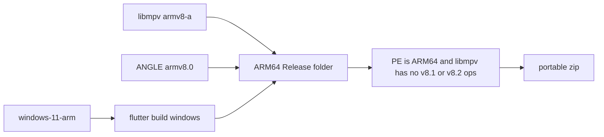

# Windows ARM64 GitHub Actions build

Add a release job that matches [.github/workflows/win_x64.yml](.github/workflows/win_x64.yml) and is wired from [.github/workflows/build.yml](.github/workflows/build.yml). The artifact is a native ARM64 portable zip (and an ARM64 installer). An x64 build cannot be used: Windows 10 on these tablets does not emulate x64.

Snapdragon 835 (Kryo 280) is ARMv8.0-A. It has no LSE atomics and no dotprod. Those tablets ship Windows 10 (1709 through 22H2) and cannot run Windows 11. The GitHub runner is a newer Windows 11 ARM CPU, so a binary that runs on the runner can still crash on the tablet.

## What the runner can compile safely

- Job `runs-on: windows-11-arm` (free on a public repo; upstream `bggRGjQaUbCoE/PiliPlus` qualifies). Private repos do not get this runner.
- Flutter 3.47.5 already publishes `windows-arm64` engine artifacts for engine `af7e796e`. On that host, `flutter build windows` targets ARM64 and writes `build/windows/arm64/runner/Release`.
- MSVC’s default is `/arch:armv8.0`. Set that explicitly in [windows/CMakeLists.txt](windows/CMakeLists.txt) when `FLUTTER_TARGET_PLATFORM` is `windows-arm64`, so a later Visual Studio default cannot raise the baseline. The `windows-11-arm` image is moving to Visual Studio 2026 through September 30, 2026.
- Do not enable `flutter_inappwebview`’s AVX2 texture fallback. The default Direct3D path uses the NuGet WebView2 package, which contains an ARM64 loader. The tablet still needs the ARM64 Evergreen WebView2 runtime installed (Windows 10 1709+). The x64 runtime will not load.

## Prebuilt video libraries

The app links `libmpv.dll.a` and then loads `libmpv-2.dll` plus ANGLE (`libEGL.dll`, `libGLESv2.dll`). Today’s Windows cmake in `My-Responsitories/media-kit` (`ref: native`) always downloads `mpv-dev-x86_64-20260607-git-43b14a4.7z` and the x64 `ANGLE.7z`. An ARM64 link fails on those files.

The aarch64 archive from the same mpv release is also the wrong CPU. [bggRGjQaUbCoE/mpv-winbuild-cmake](https://github.com/bggRGjQaUbCoE/mpv-winbuild-cmake) defaults aarch64 to `-mcpu=cortex-a76` (ARMv8.2). That DLL illegal-instructions on an 835.

Before the workflow can ship a tablet build:

- Publish one dev archive built with `-DGCC_ARCH=generic` (`-mcpu=generic`, ARMv8.0-A), and pin its URL and MD5 the same way the x64 cmake pins `mpv-dev-x86_64-20260607`.
- Publish an ANGLE zip built with MSVC `/arch:armv8.0`, not Clang `-mcpu=native` on the runner.

Apply that selection only for `windows-arm64`, via a patch on the pub-cache checkout in the ARM64 job (same pattern as [lib/scripts/patch.ps1](lib/scripts/patch.ps1)). Leave the x64 URLs unchanged so the existing Windows job stays the same.

Do not rebuild mpv or ANGLE on every PiliPlus run. Those trees take hours. Pin the archives.

## Workflow shape

New [.github/workflows/win_arm64.yml](.github/workflows/win_arm64.yml), called from `build.yml` with a `build_win_arm64` input, same tag and artifact upload pattern as `win_x64`:

1. Checkout, `subosito/flutter-action` from `pubspec.yaml`, `build.ps1`, `patch.ps1 windows`.
2. Apply the media_kit ARM64 library patch.
3. `flutter build windows --release --dart-define-from-file=pili_release.json --no-pub` (or `fastforge` if it actually emits `build/windows/arm64`).
4. Copy the ARM64 VC++ CRT beside the exe (`vcruntime140.dll`, `vcruntime140_1.dll`, `msvcp140.dll` from the ARM64 redist). These tablets do not have that runtime.
5. Zip `build/windows/arm64/runner/Release` as `PiliPlus_windows_<version>_arm64_portable.zip`.

Installer: keep [windows/packaging/exe/inno_setup.iss](windows/packaging/exe/inno_setup.iss) at `ArchitecturesAllowed=x64`. Add an ARM64 script with `ArchitecturesAllowed=arm64` and `ArchitecturesInstallIn64BitMode=arm64`, and point only this job’s `script_template` at it. An x64 Inno setup will not start on Windows 10 ARM.

## Gates before upload

The runner cannot stand in for an 835. Fail the job unless:

- `piliplus.exe` and every DLL in the zip are ARM64 (PE machine `AA64`), not x64.
- `libmpv-2.dll`, `libEGL.dll`, and `libGLESv2.dll` do not contain unconditional ARMv8.1 or ARMv8.2 opcodes (`ldadd`, `cas`, `sdot`, `udot`). Runtime-dispatched CRT helpers in the Flutter engine are a separate case: `flutter_windows.dll` is Google’s prebuilt. Disassemble it once; if its own code uses those opcodes with no CPU check, no workflow change can make 3.47.5 run on an 835.
