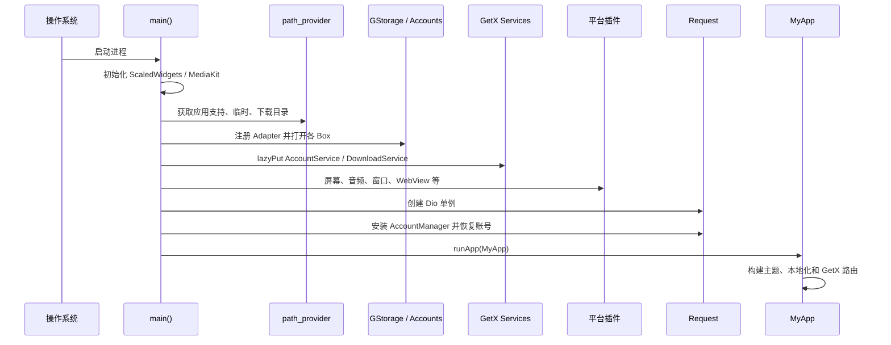
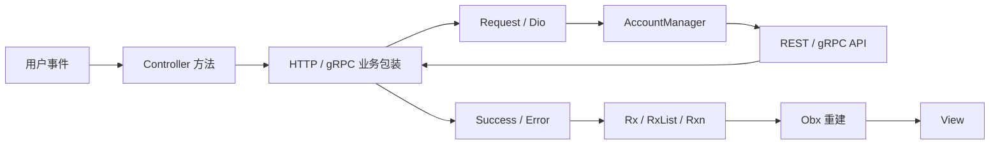
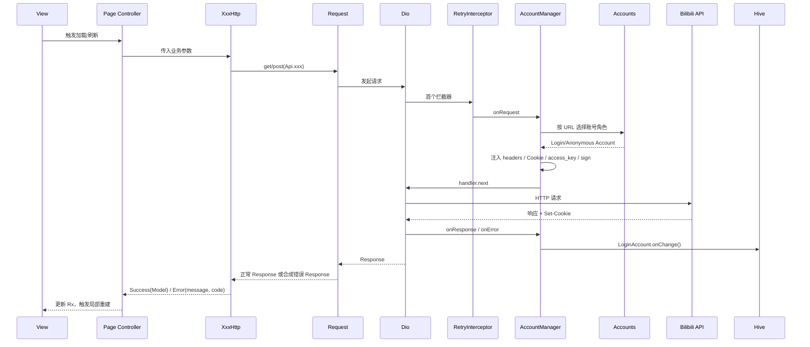
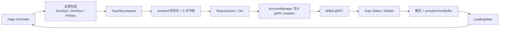
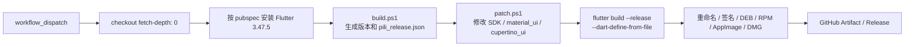

# PiliPlus 开发者路线图

> 面向第一次接触仓库的开发者。本文基于当前仓库源码整理，用于建立整体心智模型、定位代码和规划修改顺序。

## 1. 项目定位

PiliPlus 是一个使用 Flutter 编写的多平台 B 站第三方客户端，主要运行于 Android、iOS、Windows、macOS 和 Linux。

项目不是“页面直接请求 API”的简单应用，而是一个包含以下横切能力的复杂客户端：

- GetX 路由、依赖注入和响应式状态。
- Dio REST 请求、HTTP/2、HTTP/1.1 回退、重试和压缩解码。
- 多账号角色、Cookie 持久化、App 请求签名和 WBI 签名。
- gRPC-over-HTTP 与 protobuf 生成模型。
- Hive CE 本地数据库、设置、缓存和观看进度。
- MediaKit 播放、弹幕、下载及平台原生能力。
- Flutter SDK 与依赖包的源码补丁式定制发布流程。

## 2. 五分钟建立整体认知

先按下面顺序阅读，不要一开始从最大的视频页面或播放器开始：

1. `lib/main.dart`：应用启动顺序、平台初始化、根组件和路由入口。
2. `lib/router/app_pages.dart`：GetX 页面路由表。
3. `lib/pages/main/view.dart`、`lib/pages/main/controller.dart`：根页面及长生命周期控制器。
4. `lib/http/init.dart`：全局 Dio、重试、解压和错误包装。
5. `lib/utils/accounts/account_manager/account_mgr.dart`：账号选择、Cookie、签名和错误提示。
6. `lib/utils/accounts.dart`、`lib/utils/accounts/account.dart`：账号角色与持久化。
7. `lib/pages/home/controller.dart`、`lib/pages/video/controller.dart`：普通业务页面如何使用上述基础设施。
8. `lib/grpc/grpc_req.dart`：另一条 gRPC 请求链路。
9. `.github/workflows/build.yml` 与 `lib/scripts/`：正式版本如何构建。

## 3. 总体框架图

```mermaid
flowchart TB
    Entry[lib/main.dart\n启动与平台初始化]
    GetX[GetX\n路由 / DI / Rx 状态]
    Pages[lib/pages\nView + Controller]
    REST[lib/http/*Http.dart\n业务 API 包装]
    Request[lib/http/init.dart\nDio 单例]
    AM[AccountManager\n账号 / Cookie / 签名]
    Accounts[Accounts + Account\n角色 / Hive 持久化]
    Grpc[lib/grpc/*Grpc.dart\n业务 gRPC 包装]
    GrpcReq[GrpcReq\nprotobuf 帧与状态]
    Models[lib/models + lib/models_new\n响应模型]
    Storage[GStorage + Pref\n设置 / 缓存 / 进度]
    Player[PlPlayerController\nMediaKit 播放]
    Platform[Android/iOS/Desktop 原生层]
    Bili[Bilibili REST / gRPC API]
    CDN[图片 / 视频 / WebView 资源]

    Entry --> GetX
    GetX --> Pages
    Pages --> REST
    Pages --> Grpc
    Pages --> Player
    REST --> Request
    Grpc --> GrpcReq
    GrpcReq --> Request
    Request --> AM
    AM --> Accounts
    AM --> Bili
    Request --> CDN
    REST --> Models
    GrpcReq --> Models
    Pages --> Storage
    Accounts --> Storage
    Player --> Platform
    Entry --> Platform
```



### 3.1 各层职责

| 层 | 主要目录 | 职责 | 不应承担的职责 |
|---|---|---|---|
| 启动层 | `lib/main.dart` | 初始化路径、存储、服务、平台能力和根组件 | 业务页面解析、具体 API 请求 |
| 路由层 | `lib/router/` | 注册路径到 Widget 的映射 | 请求与数据解析 |
| 表现层 | `lib/pages/**/view.dart` | 布局、交互、响应式渲染 | 直接拼装底层鉴权细节 |
| 业务控制层 | `lib/pages/**/controller.dart` | 参数组织、调用 API、维护页面状态 | 全局网络连接池实现 |
| REST 业务层 | `lib/http/*.dart` | 构造参数、检查业务码、返回 `LoadingState<T>` | 管理 CookieJar 和账号角色切换 |
| 传输层 | `lib/http/init.dart` | Dio、HTTP 版本、重试、解压、技术错误包装 | 解释具体页面的业务响应 |
| 账号层 | `lib/utils/accounts/` | 账号角色、Cookie、签名、账号选择 | 页面布局 |
| gRPC 层 | `lib/grpc/*.dart` | protobuf 请求封装和强类型响应 | 绕过全局 Request 直接创建独立网络栈 |
| 数据模型层 | `lib/models/`、`lib/models_new/` | JSON/protobuf 数据映射 | 发起网络请求 |
| 本地存储层 | `lib/utils/storage*.dart` | Hive、设置、缓存、导入导出 | UI 布局 |
| 平台层 | `android/`、`ios/`、`windows/`、`macos/`、`linux/` | 平台插件与系统能力 | 跨业务共享状态 |

## 4. 应用启动流程



### 4.1 为什么启动顺序重要

- `appSupportDirPath` 必须先于 Hive 初始化，因为 Hive 数据目录由它派生。
- Hive 必须先于 `Pref`、账号和页面使用；否则静态 late 字段不可用。
- `Request()` 创建 Dio 后，`Request.setCookie()` 才能安装 `AccountManager`。
- `MyApp.initPlatformState()` 若启用动态色，必须在根主题构建前执行。
- 页面应假设存储、账号注册表和全局 Request 已由 `main()` 准备好。

关键入口：`lib/main.dart:92`。

## 5. UI 与状态管理

大部分功能遵循以下结构：

```text
lib/pages/<feature>/
├── view.dart        # Widget、布局、用户交互
├── controller.dart  # 请求编排、响应式状态、生命周期
└── widgets/         # 功能私有组件
```

典型数据流：



### 5.1 GetX 使用要点

- `Get.put/get/find` 负责 Controller 和服务实例。
- `Obx` 只包裹真正需要响应式重建的最小 Widget 区域。
- `MainController` 在根页面创建，生命周期接近整个应用；它读取的设置通常是启动时快照。
- 普通页面 Controller 可能通过 `Get.putOrFind` 复用，修改功能时要确认销毁语义。
- Controller 必须释放 `TabController`、`ScrollController`、Stream 和定时器等资源。

### 5.2 常见页面范式

以首页为例：

1. `HomeController.onInit()` 读取设置和创建 Tab 配置。
2. View 使用 `AutomaticKeepAliveClientMixin` 保留页面状态。
3. Controller 调用 `Request().get()`，再把响应解析为业务模型。
4. Rx 值变化后由 `Obx` 更新搜索词、角标或导航状态。

以视频页为例：

1. 路由参数在 Controller 中转换为 `bvid`、`aid`、`cid` 等内部状态。
2. REST、gRPC 和播放器共同提供详情、地址、字幕、弹幕及互动数据。
3. `PlPlayerController` 持有跨页面播放状态，页面 Controller 负责当前视频业务流程。

## 6. REST 请求完整链路



### 6.1 请求入口

- `Request.get()`：`lib/http/init.dart`
- `Request.post()`：`lib/http/init.dart`
- `Request.downloadFile()`：`lib/http/init.dart`

这些方法捕获 `DioException`，并返回：

```text
statusCode: 原响应状态码或 -1
data: {'message': 面向用户的中文错误}
```

因此业务包装层应同时检查：

1. `response.data` 是否为 API 正常对象；
2. B 站业务 `code == 0`；
3. 再构造 `Success` 或 `Error`。

### 6.2 账号选择

账号策略位于 `lib/utils/accounts/api_type.dart`：

| 角色 | 用途 | 典型接口 |
|---|---|---|
| `main` | 默认登录账号 | 用户资料、设置、多数 Web API |
| `heartbeat` | 观看身份/无痕身份 | 视频详情、评论、历史上报、直播信息 |
| `recommend` | 推荐流可独立身份 | 推荐、热搜、直播列表、部分搜索 |
| `video` | 播放地址专用身份 | UGC/PGC/TV 播放地址、缩略图 |

选择顺序：

1. 登录接口强制使用 `AnonymousAccount`。
2. 在 `ApiType.apiTypeSet` 中寻找第一个匹配 URL 的角色。
3. 未匹配时回退到 `main`。
4. 调用方可通过 `Options.extra['account']` 显式覆盖。

### 6.3 Web 与 App 请求差异

- Web API：使用 `DefaultCookieJar` 管理 Cookie。
- App API：通常注入 `access_key`、客户端请求头并调用 `AppSign.appSign()`。
- gRPC：走 App 基地址和字节响应，使用 `grpcHeaders`，不按普通 App REST 参数签名。
- CDN、图片、部分被屏蔽服务器：跳过 Cookie，避免凭据泄漏到非 B 站 API 域。

### 6.4 Cookie 生命周期

```text
请求前：CookieJar.loadForRequest()
  → 合并调用方显式 Cookie
  → 写入 Cookie 请求头

响应后：读取 Set-Cookie
  → 拆分合并后的多个 Cookie
  → saveFromResponse(realUri, cookies)
  → LoginAccount.onChange()
  → Hive 持久化
```

`LoginAccount.delete()` 使用删除墓碑，防止较晚返回的网络响应把已删除账号重新写回 Hive。该行为已有测试：`test/utils/accounts/deleted_account_test.dart`。

## 7. gRPC 请求链路



### 7.1 gRPC 帧格式

`GrpcReq` 发送的数据格式为：

```text
[1 byte compressed flag][4 bytes big-endian message length][protobuf payload]
```

- payload 大于 64 字节时使用 gzip。
- `Grpc-Status == 0` 才按 protobuf 成功解析。
- `Grpc-Status-Details-Bin` 包含 base64 编码的状态详情，失败时尝试提取业务错误码。
- 大弹幕响应可由 `compute()` 在独立 isolate 解析，避免阻塞 UI。

注意：仓库当前只跟踪生成后的 `*.pb.dart` / `*.pbjson.dart`，未发现 `.proto` 源文件。修改 protobuf 结构前，必须先确认上游生成来源，不能只改生成文件。

## 8. 本地存储与设置

### 8.1 Hive Box

`GStorage.init()` 打开的主要 Box：

| Box | 内容 |
|---|---|
| `userInfo` | 登录用户信息 |
| `localCache` | 可清理业务缓存 |
| `setting` | 用户设置 |
| `historyWord` | 搜索历史 |
| `video` | 视频与播放设置 |
| `account` | `LoginAccount` 列表 |
| `watchProgress` | 观看进度 |
| `reply` | 可选的评论/动态保存数据 |

### 8.2 修改设置时的陷阱

很多设置通过 `Pref` 暴露为 getter。`Pref` 的读取是即时访问 Hive，但部分 Controller 在构造时把值复制到 `late final` 或普通字段。

因此：

- 修改 `SettingBoxKey` 后，不应假设长生命周期 Controller 的缓存会自动刷新。
- 需要让相关 Controller 重新读取，或显式更新其 Rx 状态。
- 排查“设置已保存但界面没变化”时，先查设置写入，再查 Controller 生命周期，最后查 Widget 是否在 `Obx` 内。

### 8.3 设置备份

`GStorage.exportAllSettings()` 只导出 `setting` 和 `video` Box；账号、缓存和观看进度不属于该设置备份。

## 9. 目录导航

| 路径 | 用途 | 入口建议 |
|---|---|---|
| `lib/pages/` | 功能页面、Controller、私有 Widget | 找 `view.dart` / `controller.dart` |
| `lib/http/` | REST 常量、业务 API 包装、全局 Request | 找 `Api.xxx` 和 `XxxHttp` |
| `lib/grpc/` | gRPC 业务包装和生成 protobuf | 找 `XxxGrpc` / `GrpcReq` |
| `lib/models/` | 传统手写模型 | 查旧功能的响应结构 |
| `lib/models_new/` | 大量生成或细粒度数据模型 | 修改前确认生成来源 |
| `lib/common/` | 通用 Widget 和样式 | 优先复用现有组件 |
| `lib/common/widgets/flutter/` | 仓库维护/修改的 Flutter 组件源码 | 不是普通业务 Widget，修改需谨慎 |
| `lib/plugin/pl_player/` | 播放器 UI 与控制器 | 播放、弹幕、全屏、音轨问题 |
| `lib/services/` | 账号、下载、音频等长生命周期服务 | 应用级后台能力 |
| `lib/utils/accounts/` | 账号、Cookie、角色和请求拦截 | 登录态或请求身份异常 |
| `lib/utils/storage*.dart` | Hive、设置、键名 | 数据迁移和持久化 |
| `lib/utils/android/` | JNI 生成绑定及 Android 桥接 | Android 专属能力 |
| `android/`、`ios/`、桌面目录 | 平台 runner 和原生插件 | 平台编译或系统集成问题 |
| `lib/scripts/` | 版本脚本、Flutter/依赖补丁 | 正式发布和 UI 行为差异 |
| `.github/workflows/` | 五平台构建与打包 | CI 和产物问题 |
| `test/` | 自动化测试 | 当前测试覆盖较少，需主动补充 |

## 10. 常见任务的阅读与修改路线

### 10.1 修改一个已有页面

1. 在 `lib/router/app_pages.dart` 查路由名。
2. 顺着路由找到 `view.dart`。
3. 查看同目录 `controller.dart` 的 `onInit`、事件方法和网络调用。
4. 顺着 `XxxHttp` 找 `Api` 常量与模型。
5. 检查请求是否需要特殊账号角色、签名和 CSRF。
6. 查看页面是否在 `Obx` 中消费状态，以及 Controller 是否被复用。

### 10.2 新增一个普通 REST 页面

建议顺序：

1. 先确定 URL、业务码和响应模型。
2. 在 `lib/http/api.dart` 增加有语义的端点常量。
3. 在对应 `lib/http/<feature>.dart` 增加返回 `LoadingState<T>` 的业务包装。
4. 明确该接口应使用 main、heartbeat、recommend 还是 video 账号。
5. 接入已有 `CommonPage` / `CommonListController` 模式，而不是复制刷新分页逻辑。
6. 添加路由和页面入口。
7. 增加加载、空数据、错误、重试及账号切换测试。

### 10.3 修改账号行为

重点检查：

```text
api_type.dart
  → _findAccount()
  → Accounts.accountMode
  → LoginAccount / AnonymousAccount
  → CookieJar / headers / accessKey / csrf
  → AccountManager.onRequest / onResponse
```

常见问题包括：

- URL 常量不一致，导致角色规则未命中而回退 main。
- 登录接口错误地携带旧账号 Cookie。
- App API 忘记 `access_key` 或签名。
- 删除账号后被迟到的 Cookie 响应重新持久化。
- 一个账号承担多个角色时，只更新了其中一个槽位。

### 10.4 修改播放链路

```text
Video Page / Audio Page
  → VideoDetailController
  → VideoHttp / GrpcReq
  → PlayUrlModel / 字幕 / 弹幕
  → PlPlayerController
  → MediaKit
  → Android JNI / 平台插件
```

先判断问题属于：业务数据、地址鉴权、播放器状态、弹幕渲染还是平台解码，再进入对应层。不要在页面层直接绕过 `PlPlayerController` 操作底层播放器。

## 11. 正式构建与发布

### 11.1 构建流程图



入口工作流：`.github/workflows/build.yml`。

平台子工作流：

- Android：`.github/workflows/build.yml`
- iOS：`.github/workflows/ios.yml`
- macOS：`.github/workflows/mac.yml`
- Windows：`.github/workflows/win_x64.yml`
- Linux：`.github/workflows/linux_x64.yml`

### 11.2 为什么普通本地构建可能与发布构建不同

`lib/scripts/patch.ps1` 会直接修改：

- `$FLUTTER_ROOT` 中的 Flutter SDK 源码；
- Pub cache 中的 `material_ui`；
- 必要时 Pub cache 中的 `cupertino_ui`；
- iOS 分支还会修改仓库内部分文件。

补丁覆盖选择文本、手势、BottomSheet、Navigator、Sliver、图片动画等框架行为。所以正式发布不是单纯的 `flutter build`，而是：

```text
固定 Flutter 版本
  → 修改框架/依赖源码
  → 注入构建元数据
  → 平台构建
  → 平台打包
```

### 11.3 本地开发建议

日常开发优先保持 SDK 可复用：

1. 优先在仓库业务代码中修复问题。
2. 必须改 Flutter 或依赖行为时，保留对应 patch 文件及原因链接。
3. 在一次性 Flutter SDK/缓存中验证补丁，不要让本机全局 SDK 长期处于不可复现状态。
4. 修改补丁后至少验证目标平台和至少一个非目标平台，避免公共补丁造成回归。

### 11.4 版本注入

`lib/scripts/build.ps1` 生成：

- `pubspec.yaml` 的 `versionName+versionCode`；
- `pili_release.json`；
- GitHub Actions 的 `version` 环境变量。

`lib/build_config.dart` 通过 `String.fromEnvironment` / `int.fromEnvironment` 读取：

- `pili.name`
- `pili.code`
- `pili.hash`
- `pili.time`

`versionCode` 来自 `git rev-list --count HEAD`，所以发布检出必须保留完整历史。

## 12. 代码生成与不可手改边界

### 12.1 当前可确认的生成代码

- `lib/**/*.g.dart`：Hive/JSON 等生成代码。
- `lib/grpc/bilibili/**/*.pb.dart`、`*.pbenum.dart`、`*.pbjson.dart`：protobuf 生成代码。
- `lib/utils/android/bindings.g.dart`：JNIGen 输出。
- `lib/models_new/**`：大量生成式或细粒度模型，修改前需确认来源。

### 12.2 JNI 重新生成

Android Java 绑定入口：

```bash
dart run tool/jnigen.dart
```

输入：`android/app/src/main/java`。输出：`lib/utils/android/bindings.g.dart`。

不要直接维护生成文件中的业务逻辑；应修改 Java 输入后重新生成。

### 12.3 protobuf 的当前限制

仓库没有发现 `.proto` 源文件或完整生成配置。处理 protobuf 问题时：

1. 先确认生成代码的上游仓库和版本。
2. 保留可重复生成所需的源文件、脚本和版本。
3. 不要只修改 `*.pb.dart` 后提交，这会在下次生成时丢失。

## 13. 测试与质量门槛

当前仓库检测到的 Dart 测试主要是账号删除竞态测试，覆盖仍然有限。

建议优先级：

1. 账号角色映射、删除墓碑和 Cookie 合并纯逻辑。
2. `AccountManager` 请求拦截：登录接口、App 签名、显式账号覆盖、CDN 跳过。
3. gRPC 帧压缩/解压、`Grpc-Status` 和错误详情解析。
4. `WbiSign`、`AppSign` 的固定输入向量。
5. API 包装器对正常业务码、非零业务码和合成网络错误的映射。
6. 页面 Controller 的加载、空态、错误和重试状态。
7. 少量关键 Widget 测试与平台冒烟测试。

标准检查命令：

```bash
flutter pub get
flutter analyze
flutter test
```

### 13.1 重要：`flutter analyze` 之前必须先打 SDK 补丁

本项目大量使用**上游 Flutter 尚未合入**的定制 API（`horizontalDragGestureRecognizer`、`textPainter`、`_shouldIgnorePointer`、`rawText`、`SelectableRegion` 的 `selectable` / `selectionDelegate` 等），这些能力由 `lib/scripts/patch.ps1` 直接 `git apply` 到 **Flutter SDK** 和 pub cache 里的 `material_ui` / `cupertino_ui` 上。

因此在**未打补丁的干净 SDK** 上直接跑 `flutter analyze`，会得到约 **118 个假阳性 error**，例如：

```
error • The named parameter 'horizontalDragGestureRecognizer' isn't defined • lib/pages/main/view.dart:482:9
error • Undefined name 'textPainter' • lib/common/widgets/text_ellipsis/paragraph_ellipsis.dart:39:23
error • The getter 'shouldIgnorePointer' isn't defined for the type 'ScrollableState' • lib/pages/dynamics_detail/view.dart:118:39
error • Undefined name 'selectable' • lib/utils/extension/selectable_region_ext.dart:35:31
```

**这些不是代码缺陷。** 打上补丁后，同一份代码的基线是：

| 状态 | 结果 |
|---|---|
| 干净 SDK | 173 issues（118 error / 40 info） |
| 已打补丁 SDK | **37 issues，全部为 `info`，0 error、0 warning，退出码 0** |

剩余的 37 条 `info` 中有 35 条集中在 `lib/common/widgets/flutter/**`——那是项目内**内置的一份 Flutter framework 源码副本**（`text_field` 等），属于 vendored 代码，不是业务代码；另 2 条是 `vote_decoration.dart` 的 `Color.alpha` 弃用提示和 `pubspec.yaml` 中 `PiliPlus` 命名规范的提示。

打补丁的最小步骤（SDK 与 pub cache 路径按本地实际情况替换）：

```bash
# 1. SDK 补丁（patch.ps1 中 $patches 列表 + 对应平台补丁）
cd "$FLUTTER_ROOT"
for p in modal_barrier text_selection mouse_cursor image_anim layout_builder \
         navigation_drawer popup_menu fab null_safety_for_selectable_region \
         selectable_region editable_text text_field scroll_position scrollable \
         scrollable_gesture draggable_scrollable_sheet scaffold text \
         text_painter sliver refresh_indicator; do
  git apply "$GITHUB_WORKSPACE/lib/scripts/$p.patch" || echo "FAIL $p"
done

# 2. material_ui / cupertino_ui 补丁（在 pub cache 的对应包目录下执行）
cd "$PUB_CACHE/hosted/pub.dev/material_ui-<version>"
for p in modal_barrier_material navigation_drawer popup_menu fab \
         text_field scaffold refresh_indicator tabs; do
  git apply "$GITHUB_WORKSPACE/lib/scripts/material/$p.patch" || echo "FAIL $p"
done
```

> 注：`patch.ps1` 用 CRLF 版本的补丁文件；手工 `git apply` 前若报 `corrupt patch`，先把补丁转成 LF 换行。

判断一条报错是否为补丁缺失导致的假阳性，最快的办法是看它是否指向下列成员：
`horizontalDragGestureRecognizer`、`textPainter`、`shouldIgnorePointer`、`rawText`、`selectable`、`selectionDelegate`、`maxExtent`、`initialScrollOffset`、`scrollDirection`、`flex`、`hitTestBehavior`。

正式构建前还应确认：

- `pubspec.lock` 是否发生非预期变化；
- 生成代码是否与输入同步；
- 目标平台 runner 和插件配置是否完整；
- 发布脚本是否使用了完整 Git 历史。

## 14. 排错方法：从现象沿数据流反查

### 14.1 页面空白或启动失败

检查顺序：

```text
main 启动异常
  → 路径/Hive
  → GetX 服务
  → 平台插件
  → Request/AccountManager
  → MyApp 路由
  → 页面 Controller
```

重点日志关键词：`GStorage init error`、MissingPluginException、late initialization、Hive typeId。

### 14.2 API 数据不对或像是用了错误账号

```text
URL 是否命中 ApiType
  → _findAccount 选择结果
  → RequestOptions.extra 是否被显式覆盖
  → Web Cookie 或 App access_key/sign
  → 响应是否更新了 Cookie
  → 业务包装是否检查 code
```

建议在调试环境记录“URL、账号类型、mid（不要打印 Cookie/Token）”，不要记录敏感凭据。

### 14.3 UI 显示旧设置

```text
SettingBoxKey 是否写入
  → Pref 是否读到新值
  → Controller 是否缓存了 late final/普通字段
  → Rx 是否更新
  → Obx 是否包裹正确
  → 页面/Controller 是否被复用
```

### 14.4 Cookie 登录后偶发回退或账号复活

重点检查：

- `AccountManager.onResponse/onError` 是否仍在处理迟到响应；
- `LoginAccount._hasDelete` 删除墓碑；
- Hive `account` Box 中 mid 对应的记录；
- `Accounts.refresh()` 是否在角色切换后运行。

### 14.5 gRPC 解析失败

```text
请求 protobuf 类型和 URL 是否匹配
  → 5 字节帧长度是否正确
  → compressed flag 与 gzip 是否匹配
  → Grpc-Status 是否为 0
  → Details-Bin 的 Base64 padding
  → 生成的 fromBuffer 是否来自匹配版本
```

### 14.6 本地正常、CI 失败

优先比较：

- Flutter 版本是否严格来自 `pubspec.yaml`；
- `build.ps1` 是否在 `patch.ps1` 前后按工作流顺序执行；
- 平台专属 patch 是否命中；
- `flutter pub get` 是否在 patch 脚本中执行；
- `pili_release.json` 是否生成；
- 工作流是否使用 `--no-pub`；
- 平台 runner、系统依赖、签名或打包工具是否齐全。

## 15. 推荐学习路线

### 阶段 A：跑通与入口（半天）

目标：能启动应用并从首页追踪到根路由。

- 安装 Flutter 3.47.5。
- 执行 `flutter pub get`。
- 阅读 `pubspec.yaml`、`lib/main.dart`、`lib/router/app_pages.dart`。
- 在 `HomePage` 和一个设置页打断点，观察 GetX 路由与 Controller 生命周期。

### 阶段 B：普通页面数据流（1 天）

目标：独立修改一个已有列表页面。

- 从 View 事件追到 Controller。
- 阅读 `MsgHttp` 或其他业务包装。
- 理解 `Success/Error` 与响应式状态。
- 练习增加空态、错误重试和加载状态。

### 阶段 C：账号与网络（1～2 天）

目标：能定位登录态和请求身份问题。

- 阅读 `Accounts`、`Account`、`ApiType`、`AccountManager`。
- 手动区分 main、heartbeat、recommend、video 账号。
- 理解 Web Cookie 与 App access_key/sign 的分流。
- 阅读账号删除竞态测试。

### 阶段 D：gRPC 与模型（1～2 天）

目标：能添加一个已有 protobuf 服务的调用包装。

- 阅读 `GrpcReq` 帧格式。
- 从 `XxxGrpc` 追到生成模型。
- 模拟成功与失败状态解析。
- 查清 protobuf 真正的生成来源后再做代码生成改动。

### 阶段 E：播放器与平台（2～3 天）

目标：能区分业务播放地址和播放器渲染问题。

- 阅读 `VideoDetailController` 的数据加载段。
- 阅读 `PlPlayerController` 的主要状态。
- 跟踪播放 URL、字幕、弹幕到 MediaKit。
- 在目标平台验证原生插件与 JNI 边界。

### 阶段 F：发布工程（1～2 天）

目标：理解为什么 CI 构建不只是 `flutter build`。

- 阅读顶层与四个平台工作流。
- 阅读 `build.ps1` 和 `patch.ps1`。
- 在一次性 SDK 中验证一个补丁。
- 理解版本元数据、签名和平台打包。

## 16. 修改代码时的约定

- 优先编辑现有文件，避免重复页面和重复请求包装。
- 注释解释“为什么、生命周期和数据流”，不要逐行复述语法。
- 公共网络行为变更必须同时检查 REST、gRPC、账号角色和错误路径。
- 设置变更必须检查长生命周期 Controller 是否需要刷新缓存。
- 不在日志、测试快照或文档中写入 Cookie、access key、refresh token。
- 不直接修改 `*.g.dart`、protobuf 生成文件或 Pub cache；修改源或生成流程。
- 不在普通开发环境执行 Flutter SDK 硬重置或全局缓存删除。
- 跨平台功能至少验证移动端和一个桌面端，特别注意窗口、键盘、路径和 WebView 差异。
- Bug 修复优先附一个能在旧代码失败、在新代码通过的测试。

## 17. 安全与稳定性边界

仓库允许通过设置跳过 TLS 证书校验，相关代码在：

- `lib/main.dart` 的 `_CustomHttpOverrides`
- `lib/http/init.dart` 的连接池创建

该能力可能用于调试代理或特定网络环境，但会降低传输安全性。修改网络层时必须：

- 不扩大证书跳过范围；
- 不把代理或调试设置默认为生产启用；
- 不在异常日志、提交或文档中暴露账号凭据；
- 对 `badCertificateCallback` 改动进行明确评审。

## 18. 推荐的首个贡献练习

按风险从低到高：

1. 为 `AccountManager.getCookies()` 添加路径优先级和同名 Cookie 合并测试。
2. 为 `GrpcReq` 添加压缩/解压往返测试。
3. 为 `WbiSign` 或 `AppSign` 添加固定输入测试。
4. 给现有 API 包装器补齐非零业务码测试。
5. 为一个简单页面增加失败重试和空态。
6. 最后再处理播放器、平台原生或 Flutter 源码补丁类改动。

完成这些练习后，基本就掌握了本仓库最重要的开发路径：**页面 → Controller → 业务包装 → Request/GrpcReq → AccountManager → Dio → API/响应模型 → Rx → View**。
